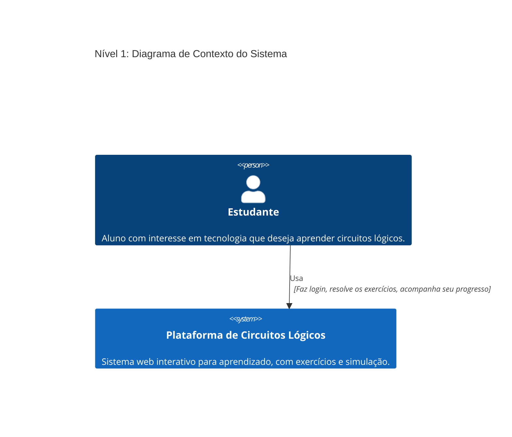
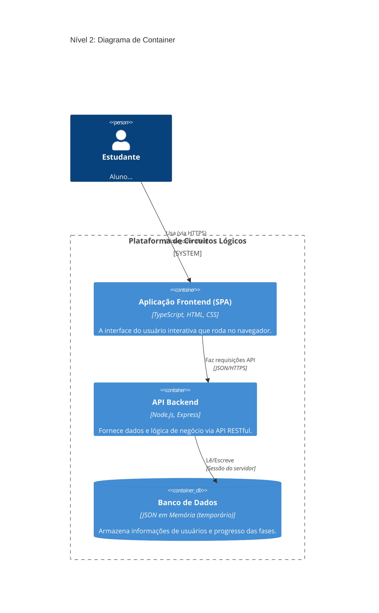
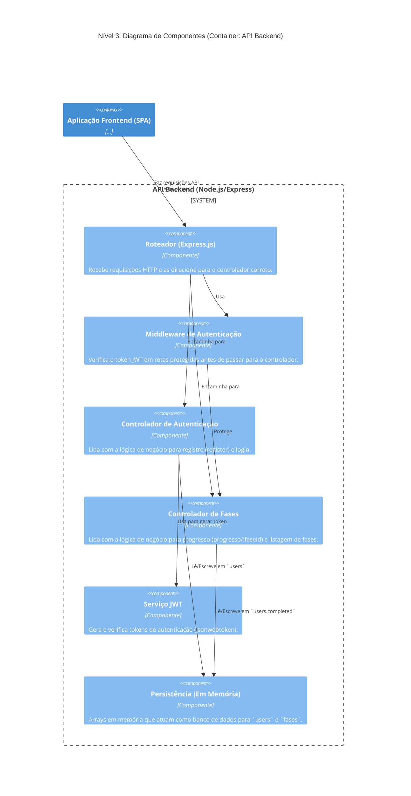

# TrabalhoMC656

**Membros:**  
Leonardo da Silva Giovanelli de Santana | RA: 256472  
André Macarini da Silva | RA: 246929  
André Rocco Drisostes | RA: 194148
Pablo Areia Delgado | RA: 223037

## Descrição do Projeto

Este projeto é um site de exercícios interativos gamificados, desenvolvido para ensinar conceitos de **portas lógicas** de forma prática e divertida. Os usuários podem navegar entre diferentes exercícios, receber feedback imediato e acompanhar seu progresso.

## Como rodar o Frontend

O frontend foi desenvolvido com **Vite** e **TypeScript**. Para rodar localmente, siga os passos abaixo:

### Pré-requisitos

- Node.js 24
- npm ou yarn

### Passos

1. Clone o repositório:

```bash
git clone <URL_DO_REPOSITORIO>
cd TrabalhoMC656/frontend
```

2. Instale as dependências:

```bash
npm install
# ou
yarn
```

3. Inicie o servidor de desenvolvimento do Vite:

```bash
npm run dev
# ou
yarn dev
```
## Como rodar testes

O projeto utiliza Vitest para testes unitários e de integração do frontend. Para executar os testes:

### Passos

1. Certifique-se de que todas as dependências estão instaladas:

```bash
npm install
# ou
yarn
```

2. Execute os testes:

```bash
npm run test
# ou
yarn test
```


## Como rodar o Backend
W.I.P

## Avaliação 4 - Arquitetura da aplicação

Considerando a quarta parte deste projeto, o descrito abaixo neste readme tem como objetivo descrever a arquitetura desta plataforma/site para aprendizado de circuitos lógicos, considerando o estado de desenvolvimento atual do projeto.

### Estilo adotado na elaboração da arquitetura

Neste trabalho adotamos como arquitetura o estilo Cliente-Servidor (Client-Server), um modelo que divide as responsabilidades do sistema em duas partes distintas e independentes: o Cliente, focado na interação e apresentação ao usuário, e o Servidor, que centraliza a lógica de negócio e o acesso aos dados.

No lado do Cliente, implementamos uma Single-Page Application (SPA). Conforme pode ser observado nos arquivos fde main.ts e pages.ts, o navegador do usuário carrega um único index.html e depoid toda a navegação é gerenciada dinamicamente pelo JavaScript. Funções como loadPage buscam os fragmentos de HTML das páginas (como home.html ou os exercicios em si como exercicio1.html) e os injetam no DOM principal (div#app) o que leva a não precisar recarregar a página inteira. O benefício principal desta abordagem é a performance e a fluidez da experiência do usuário. A navegação entre as telas de login, home e os exercícios é muito rápida, o que faz com que o aplicativo pareça até mesmo nativo.

Para o Servidor, adotamos o estilo REST (Representational State Transfer) para construir nossa API em Node.js e Express, conforme visto em index.js. O servidor é totalmente separado do cliente e expõe a lógica de negócio de forma fácil. Ele define endpoints claros (como POST /auth/login ou POST /fases/progresso/:faseId) que, ao serem requisitados, manipulam os dados e retornam respostas padronizadas em formato JSON. A vantagem desta arquitetura é flexibilidade e escalabilidaade, de forma que o frontend (a SPA) é apenas um "consumidor" da API.Assim,  o frontend SPA e a API RESTful formam a implementação do padrão Cliente-Servidor.

### Diagramas C4

Abaixo encontra-se o modelo C4 desenvolvido para descrever a arquitetura em diferentes níveis de abstração.

#### Nível 1: Diagrama de Contexto do Sistema

Este diagrama mostra a visão de como o sistema se encaixa no mundo e interage com seus usuários.



#### Nível 2: Diagrama de Container

Este diagrama faz um "zoom in" na caixa da "Plataforma" (Sistema) e mostra os principais "containers" (peças de software/tecnologia) dela.



#### Nível 3: Diagrama de Componentes (Container: API Backend)

Este diagrama se aprofunda no container da "API Backend" e detalha seus principais componentes internos e suas responsabilidades.


### Desccrição dos Principais Componentes e Responsabilidades

Com base no Diagrama de Componentes (Nível 3 do diagrmaa C4), estes são os principais componentes do Backend deste sistema:

* **Roteador (Express.js):** Ponto de entrada da API. Define os *endpoints* (ex: `/auth/login`, `/fases/progresso/:faseId`) e os verbos HTTP (GET, POST) e encaminha a requisição para o controlador correspondente.
* **Controladores (de Autenticação e de Fases):** Contêm a lógica de negócio principal. Processam a requisição, validam dados, interagem com os serviços (como JWT) e com a persistência, e formulam a resposta a ser enviada ao cliente.
* **Middleware de Autenticação:** Componente de segurança que intercepta requisições em rotas protegidas. Ele valida o token JWT enviado no cabeçalho `Authorization` para garantir que o usuário está autenticado.
* **Serviço JWT:** Abstrai a lógica de criação e verificação de tokens `jsonwebtoken`, mantendo o `SECRET` seguro e a lógica de expiração centralizada.
* **Persistência (Em Memória):** (Atualmente em `index.js`) Atua como nossa camada de dados. É responsável por armazenar e recuperar diretamente os dados dos arrays `users` e `fases`.
```
